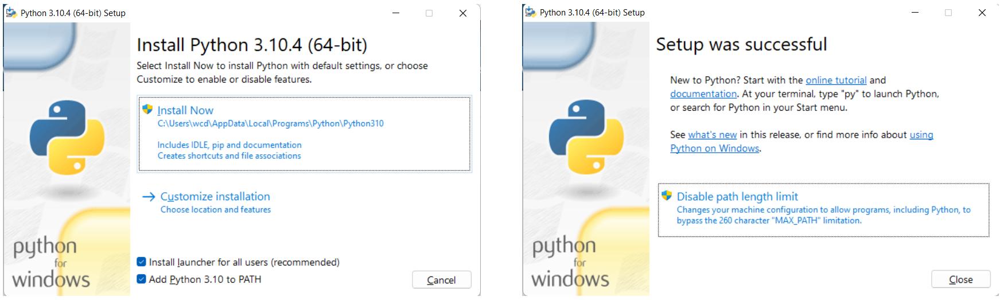

# Python 3.10+

Windows 11 Pro, Python 3.9+, Git for Windows, VS Code

## Install Globally

[Download Python](https://www.python.org/)



## VS Code Virtual Environment

1. Install the Python (Microsoft) + Pylance (Microsoft) extensions.
2. Restart VS Code.
3. Open project directory in VS Code.
4. In VS Code, open Git Bash terminal.

```
py -3 -m venv venv
venv/Scripts/activate.bat

# Command Palette > Select Interpreter > Enter path
# Browse to and select `project\venv\Scripts\python.exe`
# Kill / start new terminal. May need to restart VS Code.

# Prompt now shows (venv). Do a sanity check. 
which pip3

# Install requirements.
py -m pip install -r requirements.txt --upgrade

# At the very least:
py -m pip install --upgrade pip
py -m pip install setuptools
py -m pip install wheel
```

## requirements.txt

[How to specify requirements]()

This is a simple `requirements.txt` - it goes in the project root:

```
pip
setuptools
wheel
python-decouple
requests
# pytz
# appdirs
# Pillow
```
Install everything in this file: 

```
py -m pip install -r requirements.txt --upgrade
```

## Issue: Terminals and  `Unexpected '&'`

Note that as of 2021-07-19, Git Bash and Command Prompt terminals prefix commands with `&` instead of `source`. This is a VS Code issue that is being fixed but has not been released. Issue does not affect PowerShell terminal. 

If you want to use Git Bash (you do), there is an 'approved' workaround here: (microsoft/vscode-python/issues/16175)[https://github.com/microsoft/vscode-python/issues/16175]. In short, add this to your `settings.json`:

```
    "terminal.integrated.defaultProfile.windows": "Git Bash",
    "terminal.integrated.profiles.windows": {
        "Git Bash": {
            "source": "Git Bash",
            "icon": "terminal-bash"
        }
    },
    "terminal.integrated.shell.windows": "C:\\Program Files\\Git\\bin\\bash.exe",
```

## Issue: `Import module could not be resolved from source Pylance`

Reason: Modules are installing globally instead of in the venv. Check:

* `which pip3` points to `venv/Scripts/pip3`.
* `venv/Lib` for the installed packages.

Reason: No empty `__init__.py` in root + subfolders. 

* Add `__init__.py`. 

